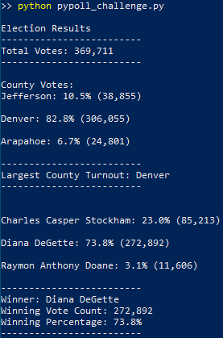

# Election_Analysis

## Overview of Election Audit

- Election results have been provided to an analyst in CSV format containing ballot ID, county of ballot, and canadidate voted. The analyst has been requested to use python to analyze the data and to use python the generate the election summary into a txt file.

## Election Audit Results
[Text output](analysis/election_analysis.txt) 

- Total votes casted this congressional election: 
  - 369,711

- Breakdown of count and percent of total votes for each county:
  - Jefferson: 10.5% (38,855)
  - Denver: 82.8% (306,055)
  - Arapahoe: 6.7% (24,801)
- Largest County Turnout: 
  - Denver 
- Breakdown of count and percent of total votes per candidate:
  - Charles Casper Stockham: 23.0% (85,213)
  - Diana DeGette: 73.8% (272,892)
  - Raymon Anthony Doane: 3.1% (11,606)
 
- Winning Candidate:
  - Candidate Name: Diana DeGette
  - Winning Vote Count: 272,892
  - Winning Percentage: 73.8%
  
Powershell Output: 

## Election Audit Summary 
This script in its existing form can be used to evaluate the election results of any number of candidates in any number of counties, as long as the raw data is provided in the CSV containing "Ballot_ID", "County Name", "Voted Candidate" in that specific order. Suggested modifications to the script would include:
1. Addition of tie scenario in the case where more than one candidate or one county shares the highest vote count.
2. Addition validation checks to Ballot ID to ensure there is no data import error such as filtering duplication and length of ballot ID.
